# Execute Summary

This is a report for my SWS software security CAP1 or assignment 1. it is mainly hosted for performing a penetration test on a server deployed within the Gedu College Network.We can exploit the wifi using the given ip address i.e **10.3.21.140** and we have to be connected to the college network and the server isn’t available from the Internet like Bmobile or TashiCell. 

# Testing Approach

While exploiting this network i used tools such as ping to check whether i can communicate with the machine. namp- to scan the wifi. gobuster to brute froce what is inside the given ip address ,and metaexploit- to exploit the given versions. when i using gobuster i have found some website 

# scope 
penetration test on Gedu college network
IP ADDRESS:**10.3.21.140**

# Assessment Overview and Recommendations

During my penetration test on the machine of the ip address i.e 10.3.21.40 I was only able to exploit port 3306(mysql) using metaexploit. i have tried to exploit others like http,ssh,postgresssql but it didn't went well as i expected.

while i used gobuster on the given target ip address i found 4 website.the first one was blank the second one was phpAdmin login page, third one contain some folder.last page takes me to a TWIKI page. inside Twiki page there was lots of documentation. in one of those i found up a upload page. 
After finding the Twiki page I tried to upload a php file in the upload form and do netcat stuffs but it was unsuccessful.

Then I found out a awesome tool that is metaexploit.I have tried to exploit most of the ports in ICTO wifi. 

# Network Penetration Test Assessment Summary

This penetration testing is for the assement of Software Security module test the capabilities of us to exploit the machine with ip address 10.3.21.140

## Detailed Walkthrough

### scan 
Firtly i scaned the network of ICTO. I have scaned most of the network of college and each wifi differs by port open. this wifi is the one with most port open.

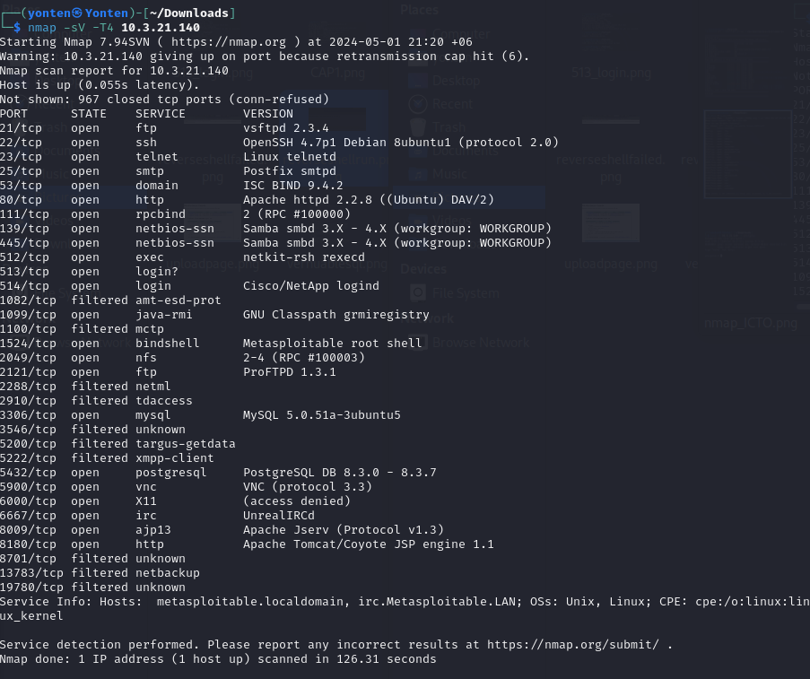

### Looking what is in the target ip address

I browse what is in the target ip address and there is a message for the SWS students.

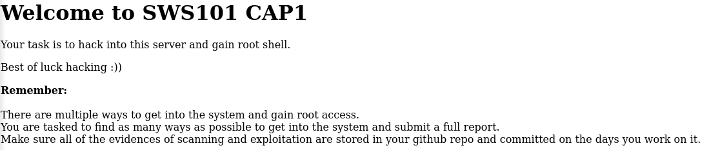

### Using gobuster-finding hidden file in the target ip address

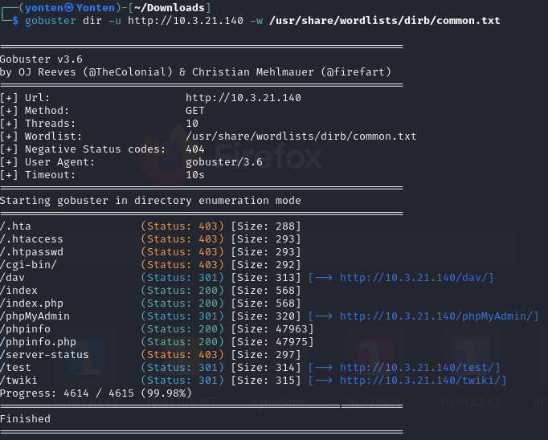

Using gobuster i found out some of the hidden website inside the ip address.the relevent website are a login page for php admin,Twiki documentation.

### Uploding file  
#### Uploding file in Twiki
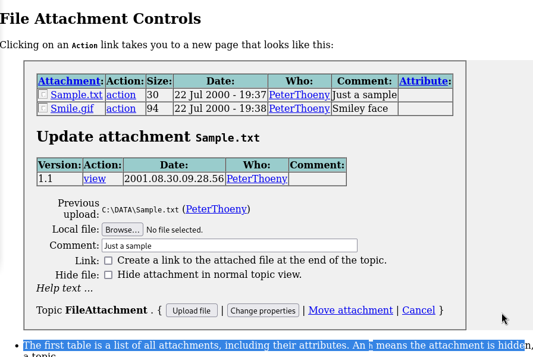

Inside the Twiki documentation I found a page to upload and I use the same technique as i did in my TryHackMe rooms, like uploading a php file.
Interesting thing is that i was able to upload but it doesn't show the uploaded file, i have tried to find the uploaded file but couldn't, so i left the plan to exploit the Twiki page.

#### Uploding file in dav 
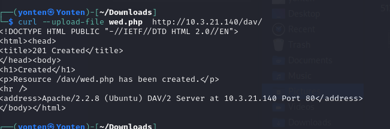

Then I also tried to upload file in the dav website.

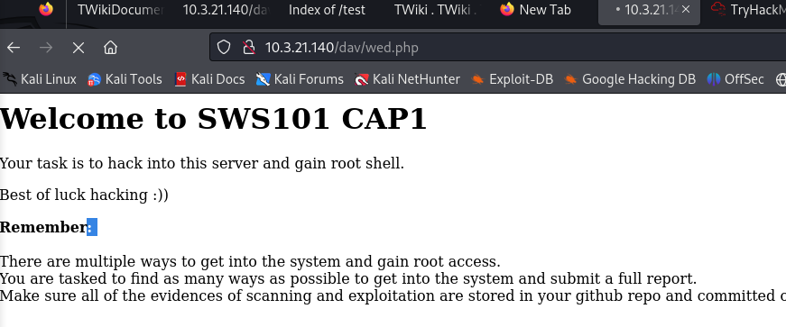

then it was uploading to dav page

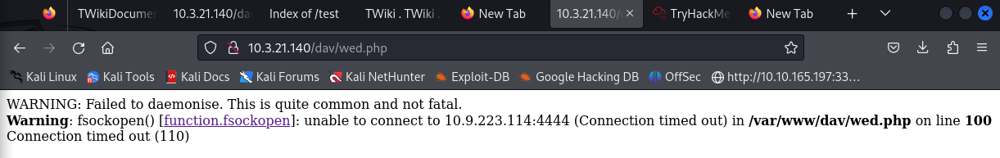

But unfortunately it also failed. 

### Metaexploit
#### exploiting http 
Now this is how i exploited the port 80 that is http using metaexploit.

 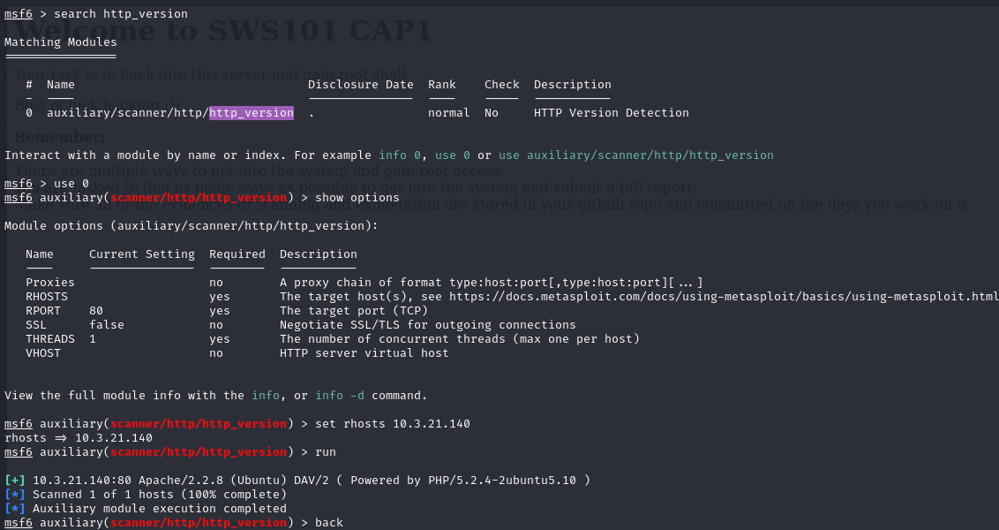

first i searched the http version so that i can hack the outdated version for a better good.I found only one version and i use that by setting the index to 0. Then i have set the **RHOSTS** to 10.3.21.140. and run it. Then I browse the provided version and found out it is **php_cgi**

 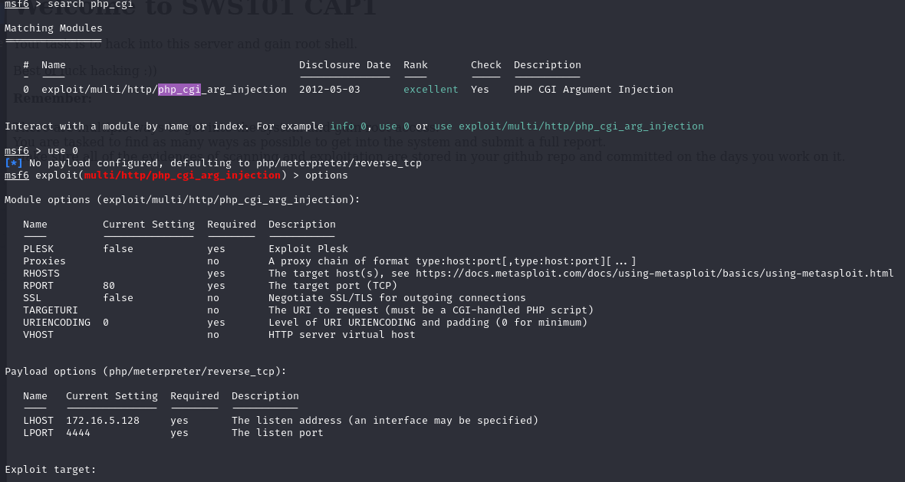

Then i search php_cgi in it in metaexploit

 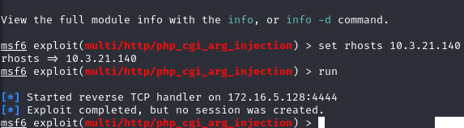

Lastly i set the RHOSTS to target ip address and run it but it was uncessful.

### Exploiting postgres
I did a vernuability scan in port 5432 that is postgres and it was vernuable.

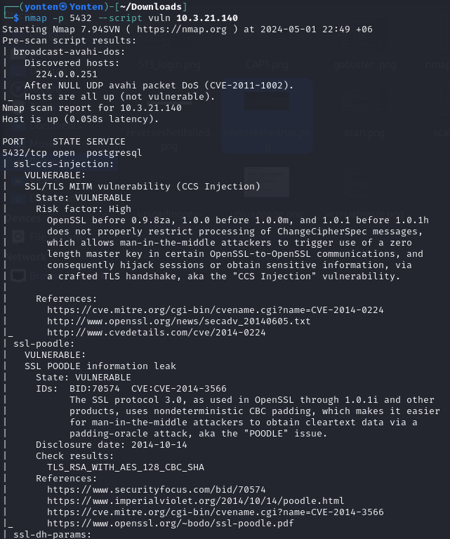

Then I used metaexploit tool to search postgres. 

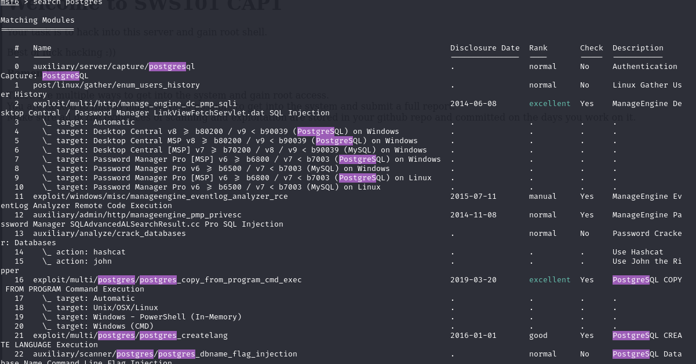

Then use show options to see what files are there.

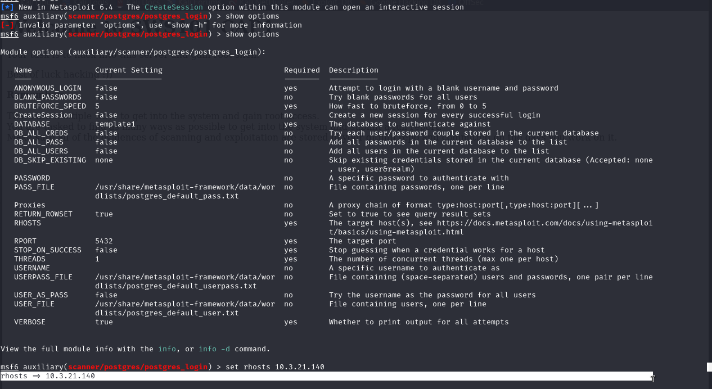

after that i set the rhosts to target ip address.set username to postgres.
then set user_as_pass to true and run it. the final one was successful and i logged in into the postgres using the user and password i got from the brute force.

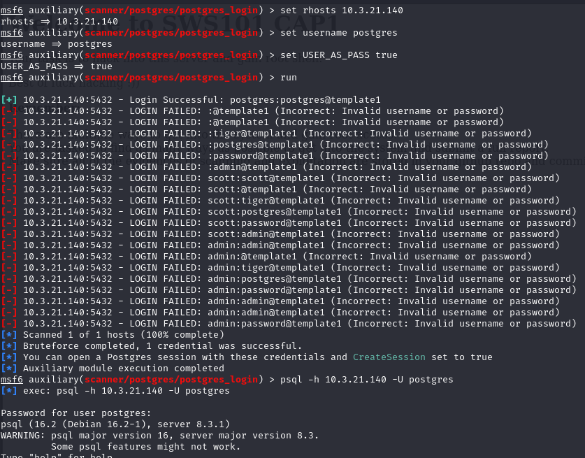

Inside the postgres i created my own table and wrote my own name in there indicating i was able to exploit that port.

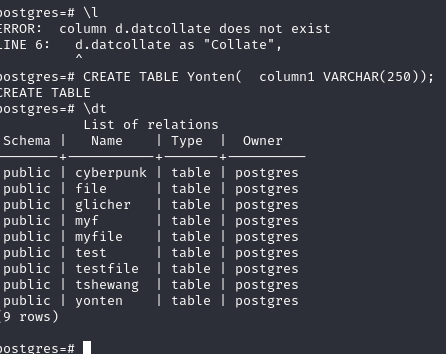

## Remediation Summary

The machine is a outdated versions. the version needs to be updated.Using the outdated version of the server can lead to loss of informations and unauthorized access. Using multi-factor authentication can also provide an extra layer of protection against unauthorized access.
